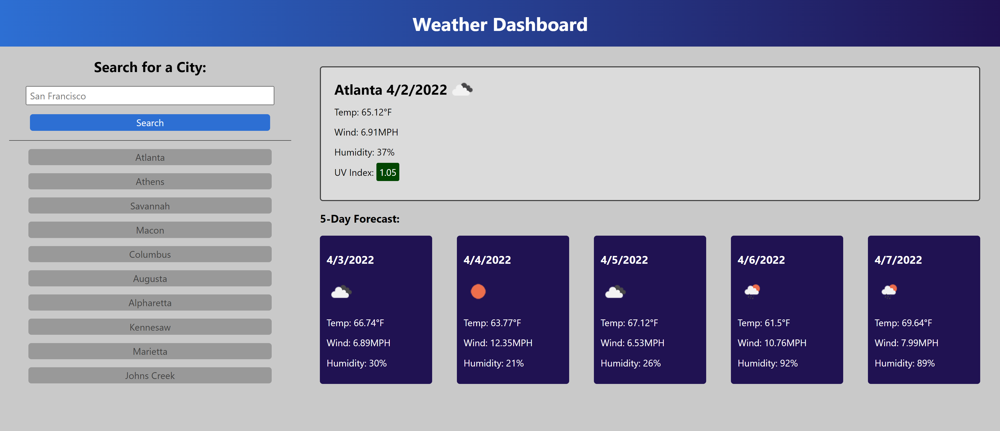

# weather-dashboard

## Description

**Goal:** To use Third-party APIs to create a dynamically updated weather dashboard.

Have you ever left your home in a hurry and your outfit didn't match the weather? This app was created to display a weather forecast in any city. It displays the current day's forecast and the next five days as well.

I used the [OpenWeather One Call API](https://openweathermap.org/api/one-call-api) to retrieve this data.

## Development

1. Wireframed webpage based off mock-up.
1. Wrote basic HTML structure and added class/id names for moving parts.
1. Wrote basic CSS to match mock-up.
1. Implemented data retrieval using fetch requests.
1. Used DOM manipulations to append relevant data to the page.
1. Implemented search history feature and local storage use.

## Deployment

[Deployed Link](https://supsha878.github.io/weather-dashboard/)